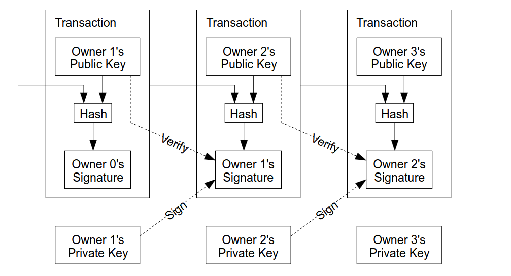

# Prof of Work
- Consensus that a certain huge number of peers try to find a secret in order to create a certain block
## Transactions 

- A block has a chain of blocks, the transaction also has a chain of transactions
- the coin itself is a chain of digital signatures
- one transaction represents the hashing of the previous transaction, along with the new owner public key using the current owner private key signing
- We have that signing only to prove that the data is true, because we dont have access to the private key and the public key confirms the content in the transaction by veryfing the signing
- There is a chain of transactions per account, which means there is a genesis transaction per account as well
- Access the [transaction go representation](./PoW/transaction/transaction.go). The workflow is on a [simple unit testing](./PoW/test/transaction_test.go)  
## Timestamp Server
- In order to have a common timestamp, we use a consensus algorithm to determine the timestamp of every node
## POW
- It is a mechanism where we apply a certain nonce (which is a random value)
- This nonce will be placed inside of the block data and when hashing that block, that block should fulfill a pow consensus criteria like for example that hash having 5 zeros for example
- In case the nonce is found at the same time as other nodes, the submited block will be the one that has the longest chain
- Difficulty is calculated by the numbers of nodes that are mining, this means that the more nodes are, then more fast is to get a block on the network
- Difficulty is calculated uppon every 2 weeks approximadelly
- Basic example without the difficulty level is [this](./PoW/block/block.go). Test suits that run this login are [here](./PoW/test/block_test.go)
## Network
- New transactions are broadcasted to all nodes
- Each node collects new transactions into a block
- Each node works on finding a difficult proof-of-work for its block
- When node fins a proof-of-work, it broadcasts the block to all nodes
- Nodes acceppt the block only if all transactions in it are valid and not already spent
- Nodes express their acceptance of the block by working on creating the new block in the chain, using the hash of the accepted block as the previous hash
- Nodes store branches of chanins and go always to the longer one. That may involve forgetting the current work to work on the most bigger chain
- New transactions do not necessary reach all nodes, in case they not, a block will be eventually received and the node will request the missing information knowing that information is missing by receiving a block with a huge number than expected
## Incentive
- Nodes receive incentives to remain honest
- They earn new issued coins and a transaction fee paid by the sender of the transaction
- Node needs to choose between making fraud or playing by the rules, where playing by the rules is the most profitable option
## Reclaiming Disk Space
- As we go further in time, the disk space would be full filled by the blockchain data