# Raft
[White paper](https://raft.github.io/raft.pdf)

[Dissertation](https://web.stanford.edu/~ouster/cgi-bin/papers/OngaroPhD.pdf)
- A consensus algorithm which aim is to be more easier to understand and maintain
- To perform operations the majority of nodes need to have the same configuration
- 3 noticable characteristics from Raft:
 ```
 -> Strong leader: It uses a stronger form of leadership than other consensus algorithms. ex: Logs only flow from the leader to other servers (simplifies log replication management, it is more easy to understand also) 
 -> Leader Election: It is achieved by randomized timers to elect the leaders. By making random elections, it forbiddens other peers of concurrently try to become the leader. Also conflits and events also follow this randomness, making it simplier to solve
 -> Membership changes: In case configuration changing, the majority of nodes dictate the configuration to execute some operations
 ```
- In hyper ledger fabric the term "leader" of the peer takes action when the orderer plays the client role against the peers. The peer leader receives the messages and broadcast them to the other peers
## Replication problem
- It is a concept about replication of state between machine. Multiple machines it identical copies.
- There are a lot of solutions for this problem, one is to have this state in external components such as in kafka (zookeepers). Note that the state is the consensus module which is a bunch of ordered commands that are later executed by a state machine. Inside of a replication solution are multiple states, that were achieved by a certain consensus
### Consensus algorithms properties
- They ensure safety
  ```
  Never return an incorrect result. Under all non byzantine conditions like network delays, partitions, packet losses, duplication and reordering
  ```
- They are fully functional (available)
  ```
  They provide high availability uppon the failure of some of its members
  ```
- They dont depend on timing to ensure the consistency of the logs
  ```
  Faulty clocks can at worst cause availability problems
  ```
- Overall system performance will not be impacted by the minority of nodes
  ```
  Only needs the majority to work perfectly, slower nodes do not take down the performance
  ```
## Problems
- A new leader must be chosen when an existing leader fails
- The leader must accept log entries and force others to have the same vision as him
- only one leader must be elected
- if there is a log with the same index, then the value must be identical
- after commitment, there cannot be changes in the content of a given log entry
- cannot give different answers to the same index despite requesting different servers

## Raft Basics
- Raft cluster contains multiple servers (atleast 5 to tolerate until 2 failures)
- Each server has 3 state: leader, follower or candidate
- In normal operation theres is only one leader and the rest are followers
- Followers issue no requests, they only respond requests from leaders and candidates
- Leader handles all the client requests
- Case a client contact a follower, the follower contacts the leader
- The current situation of the ledger is measured by terms, if a leader has a term inferior than another server, then it steps up as the leader and becomes the follower
- Once a follower stops earing about a given leader, it will make a election timeout with a random value
- In election mode the candidate can win, can receive a leader connection which means he losts or it can receive the information that the leader was not set
- A candidate wins an election if it receives votes from the majority of the servers in the full cluster for the same term
- After winning, it sends a RPC saying that he is the leader. others may accept or reject him as leader depending of the term value it retain. Case it is higher it accepts, otherwise it rejects
- Election timeouts are random, to prevent servers to request votes from other servers at the same time so they can earn the majority of votes first
- Leader will send the log entrys to every server and then commit the log entry in its state machine, runned by order. If a server has not received the log, then it sends repeadly until it receives even thought the log was already commited. After the the leader commitment, every follower that has the log commits the logs
- Leader performs consistency checks, where it tries to find the lastest block that both agree on and then sends its perspective which should be "absolute"
- A leader retains a index of the logs the followers of him retain, which means he will check out that number in order to understand if there is incosistency between the both states
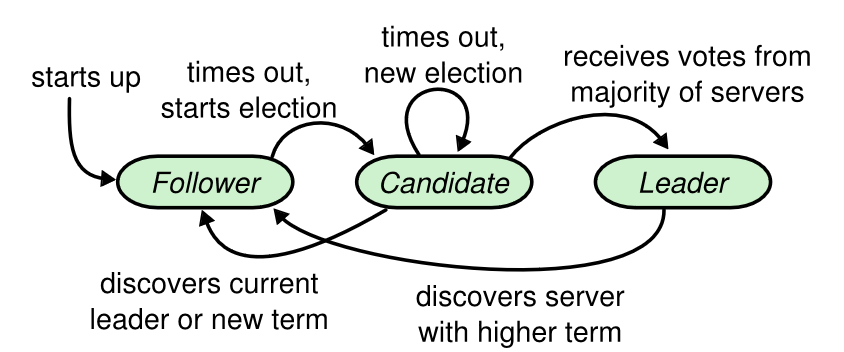
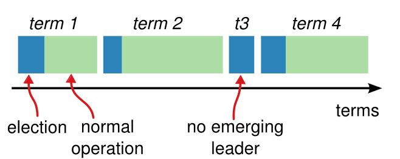
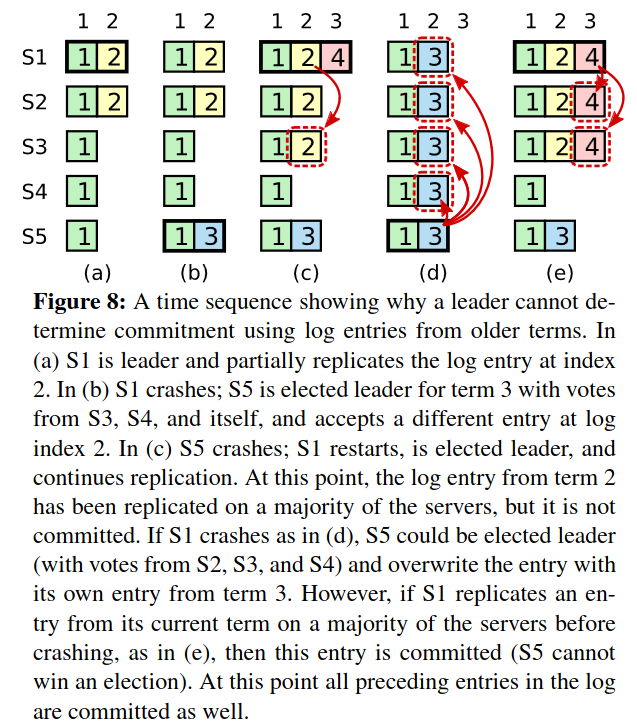
- We should note that the sequence will be maintained because in case a leader fails, in the election if the block got commited, if there is a node that has more terms than the candidate, it will reject that node voting, also the candidate automatically looses the election because we just received a confirmation that someone has a more updated state
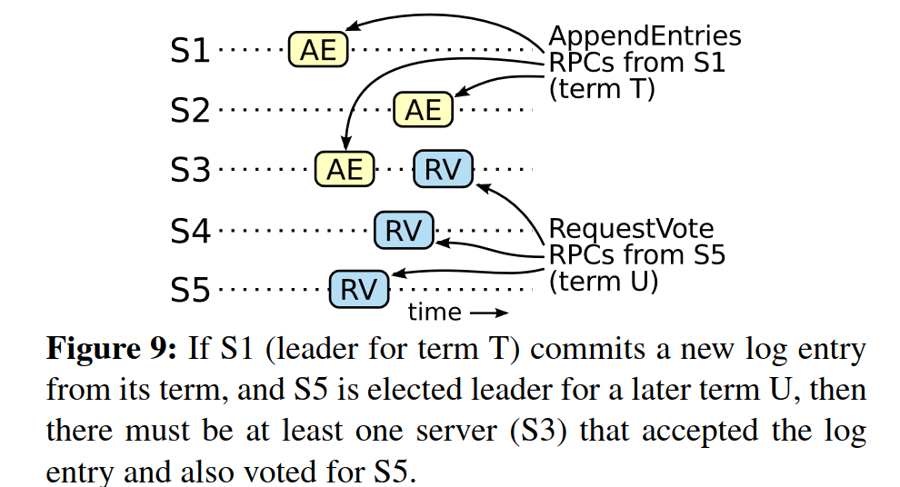
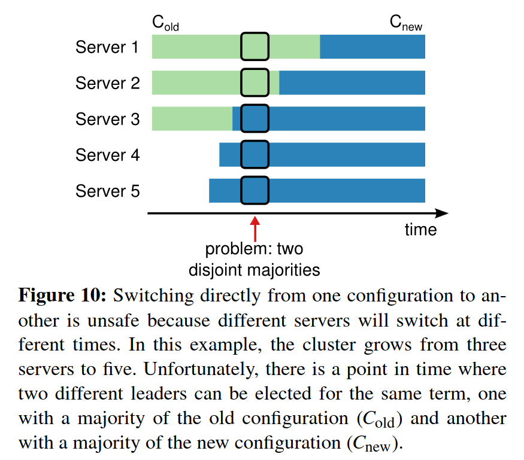
- broadcastTime ≪ electionTimeout ≪ MTBF
  ```
  broadcastTime has the obligation to be less than the electionTimeout, in order to receive correctly the hearthbeats of the leader. MTBF, should be greater than the electionTimeout,because it is the average time a node takes to fail
  ```
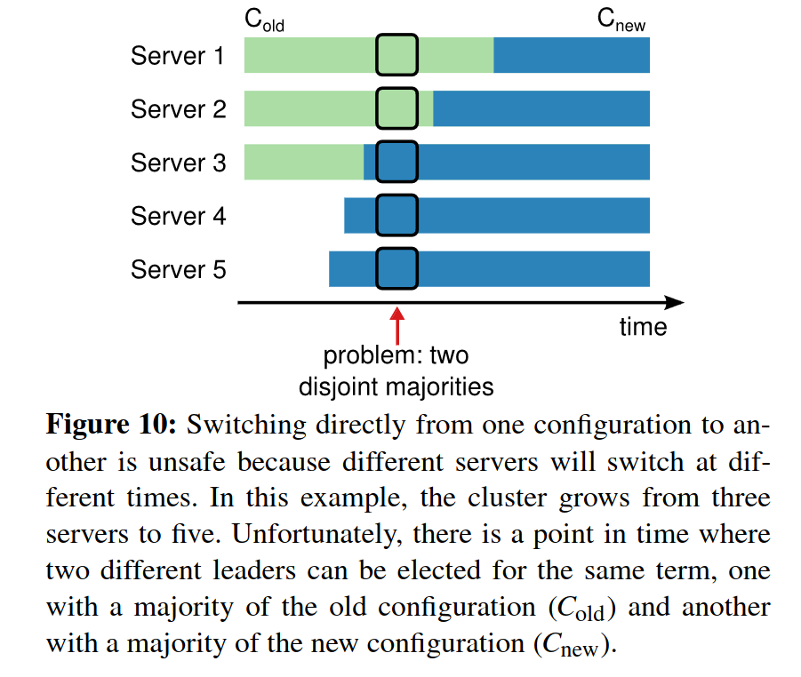
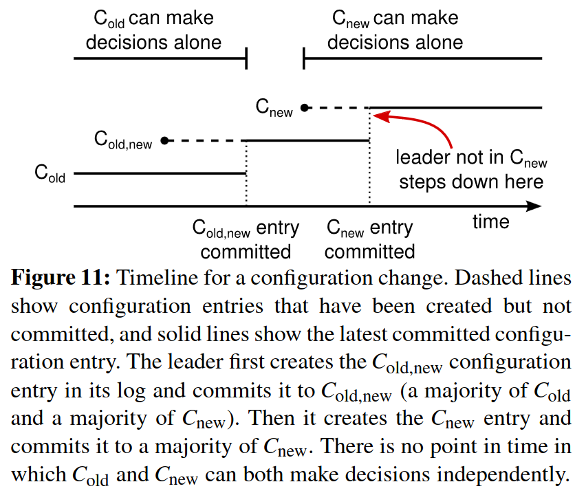
- In order to solve this problem of 2 configurations lead to a election of two leaders, Raft firstly acknowledge every server of the new configuration. This servers can be servers with old configuration or with the new. After that message becoming comitted in the majority of nodes, the leader starts to communicate only with the servers that retain and agreed uppon the new configuration. Note that in order to the new configuration take place the majority of nodes with both configs must accept this configuration
- Configuration log entries are stored in special entries
- Also before making this majority voting, peers that will retain the new config must be non-voting peers that are catching up the information
- After transfering to the new configuration, the leader at that time will discard himself from the consensus since he still has the old configuration
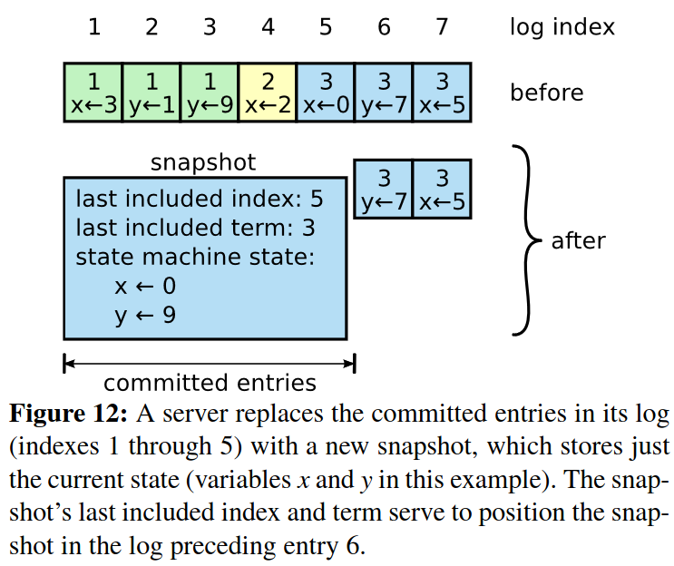
- A effective way to restore the state, is instead of receiving every log entries, which are basicly command, we simply download a state from the snapshot store. After that downloading the state we know which commands/log entries to request from there, because the snapshot saves the last included index and the last term, enabling us to request command from that 
## Condenced summary
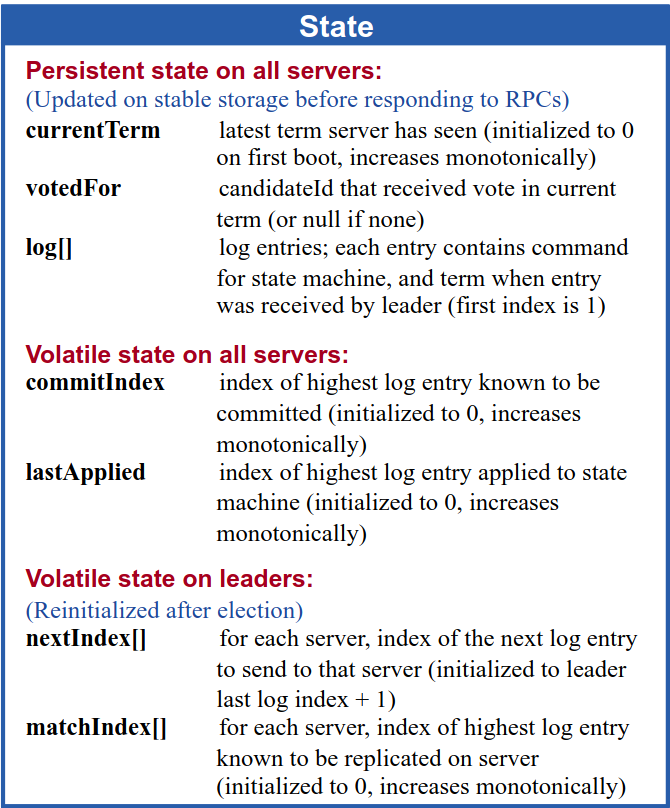
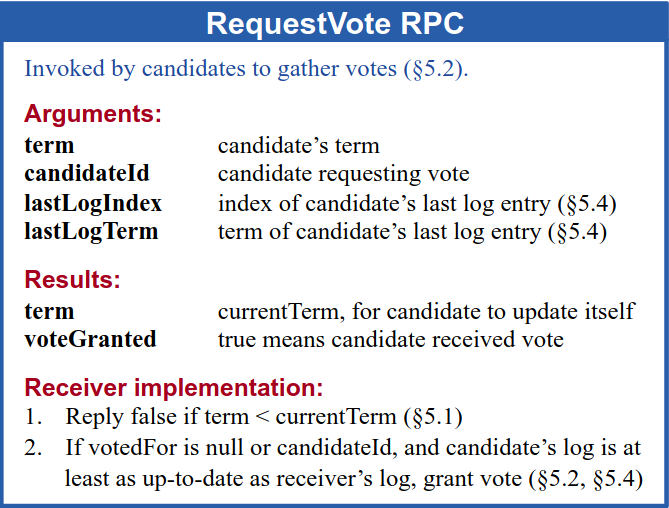
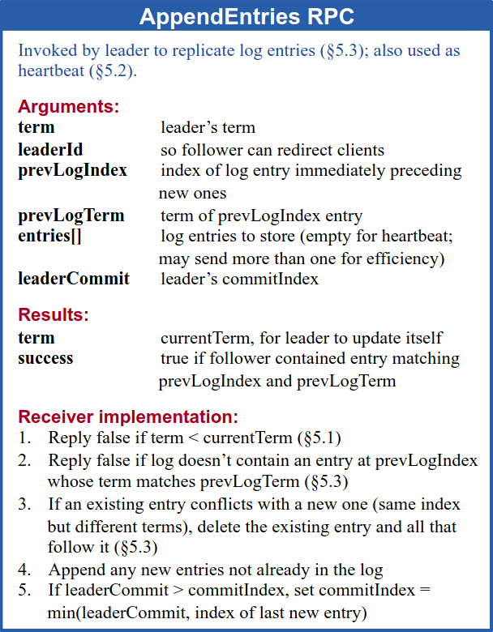
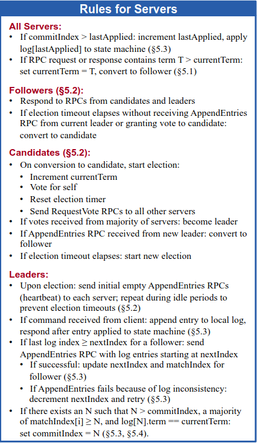
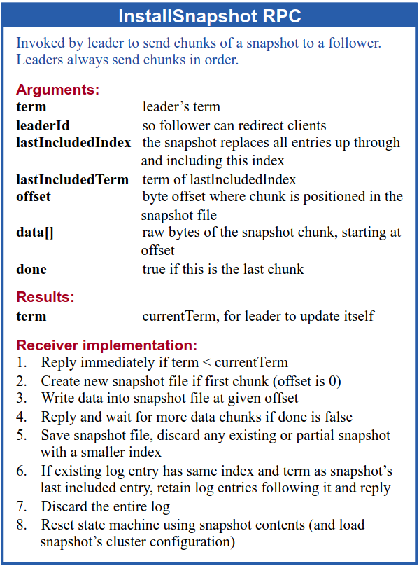