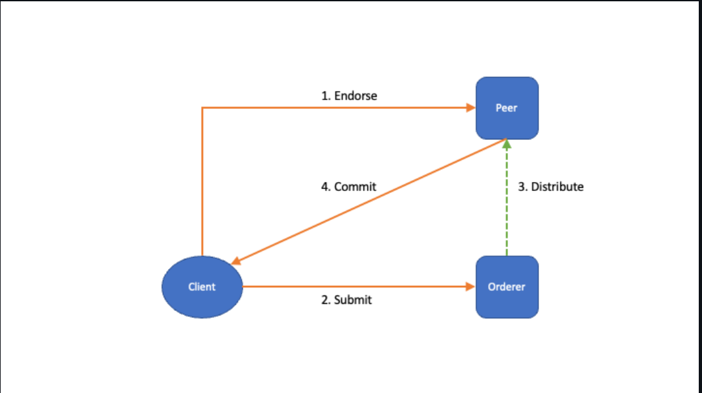
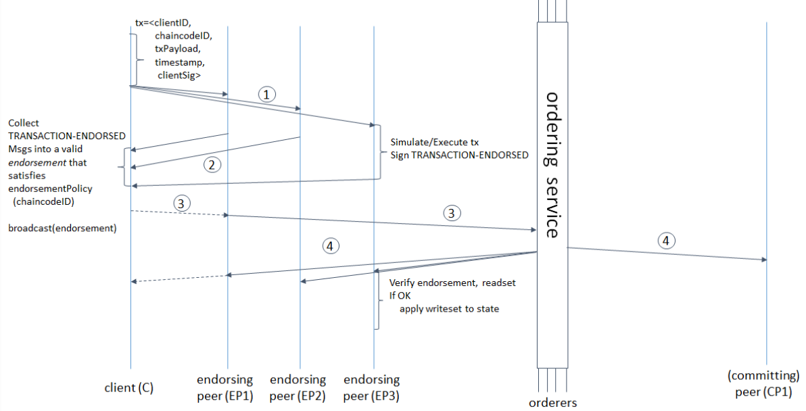
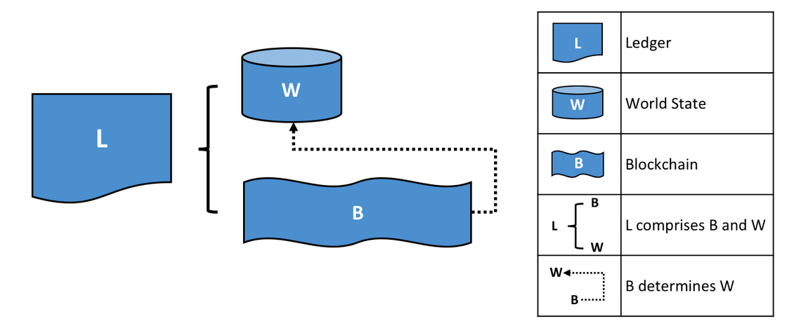
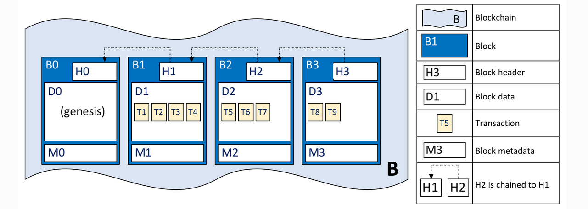
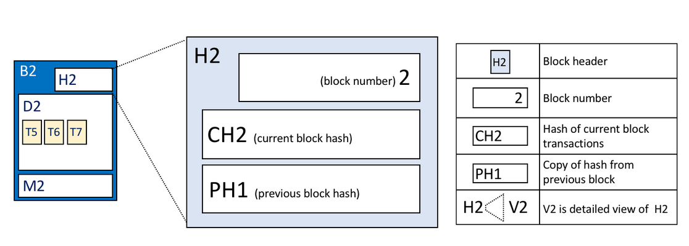
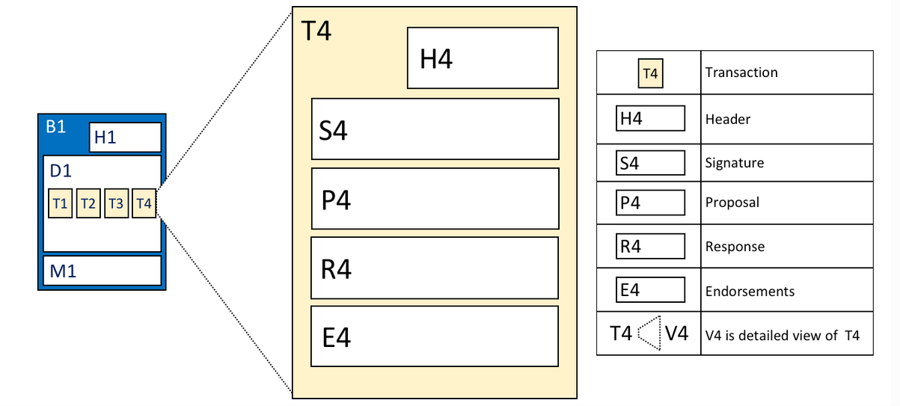

# Transaction flow

- This is the normal workflow that happens when we try to make a request to the hyper ledger fabric network
- Firstly we endorse, then we submit, the orderer distributes and then there is a commit
1. Endorse: Client send a transaction proposal to peers to endorsersement. 
- The peer executes against his own ledger to produce a read/write set and a return value from the transaction
- Multiple peers will replicate the same action, if there are a suffient gathered sucessfull endorsements that satisfy the condition, the transaction will continue, otherwise it will fail
- If a peer validates a given endorsement, then it returns the endorsement signed by him
2. Submit: In this fase the clients send a already endorsed transaction to the orderer, the orderer will order a bunch of received transactions, convert them into a block, sign the block and replicate that block to others
3. Distribute: The fase that we mentioned where the orderer distributes the blocks
- Blocks come to the peers and the peers validate the signatures of the read/write sets
- Invalid transactions are marked with an appropriate validation code and do not update the ledger
- A common error when validating is MVCC_READ_CONFLICT, which happens when a given key that is beeing accessed has changed before the operation you intend to do
4. Commit: Client will receive a commit status from the peers (in raft protocol the leader will retrieve a status about the transaction if either is valid or not)
## Transaction evaluate flow
- Evaluation represents a query
- It is intended only for simulations of a transaction, so in case you need to make querys against information that is retained on the ledger or you wish to know a error message that comes from a given transaction that you do, you evalatuate is since it does not change anything in the ledger. In the fabric SDK, when you make a invalid request that updates the ledger without using the evaluation func, it throws a error of revertion without specifieing the motive.. thats when we should use evaluation then, to check whats the cause of non submission

# Transaction composition
## Ledger
- Bank of facts about objects
- State of objects
- The history of facts is immutable
- Ledger has two distinct concepts: world-state, which is the current values and the blockchain which is the history of logs that changed the world-state.
  


## Blockchain

## Blocks
- It has 3 sections
  ```
  -> Block Header
        -> Block number, start at genesis block until the current block, every block increments 1
        -> Current Block Hash, current hash of the block
        -> Previous Block Header Hash, previous block hash
  -> Block Data, list of transaction arranged in order
  -> Block Metadata, it contains the signature of the block creator used to verify it by other network nodes. This info is not apart of the block hash
  ```

## Transactions

- Header, essential metadata about the transaction (name of the chaincode,version,etc..)
- Signature, signature of the client application to make sure that it does not get tampered
- Proposal, input parameters that intend to change the world state
- Response, before and after values of the world state as Read Write set (RW-set) which is the output of the smart contract. In case this is validated, it will be applied in the world state
- Endorsements, the list of signatures from each organization, sufficient to satisfy the endorsement policy
## Namespaces
- The world state is sogregated between namespaces, which means that there is a namespace per chaincode
- But the transactions and operations done within that namespaces are all together in the blockchain
## Channels
- There is a ledger per channel