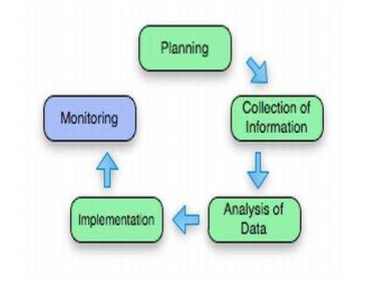

# Benchmarking purposes & goals
- In order to a company be successfull it needs to evaluate its performance in a consistent manner
- In order to achieve it, businesses need to set standards for themselves and measure their processes and performance against recognized industry leaders, or against other industries best practises, which operate in a similar enviroment
# Step-by-Step Approach for Benchmarking

- There are 5 fases to achieve benchmarking: 
  
Planing -> Collection of information -> Analysis of data -> Implementation -> Monitoring

## 1. Planning
- Identify activities that need to be benchmarked(focus on processes that can give competitive edge to the business)
- This activities normally have: high cost, volume or value
- Think about how the results of benchmarking should be collected, which inputs and outputs we desire and find ways to measure it that can be comparable: choose the write metrics
- Know the proccess flow
- Know that improving one competency at cost of detriment of another proves to be of little use
- Know how to document the interventation that you intend to do
- Know the goals, the business processes, customer expectations and critical success factors
- Gather the weaknesses and strengths of the companie
- Choose a already done benchmarking of other enterprise to compare
## 2. Collection of information
- Once the planning is over we shall gather information
- Gather data from primary sources such as enterprises and from secoundary sources such as press,publications or websites
- Make exploratory research, market research, quantitative research,informal conversations, interview and questionnaries if needed
## 3. Analysis of data
- Fase of data presentation
- Data analysis, data presentation, results projection, performance gaps classifying and founding the cause of such gap is needed here
## 4. Implementation
- A action plan is generated here, this plan needs to be in agreement with the organization culture, minimizing the resistance, ensuring that the staff is fully commited and ensuring that there is enought resources to do so
## 5. Monitoring
- Making systematic evaluations in order to maintain or even make adjustments to the established improvement