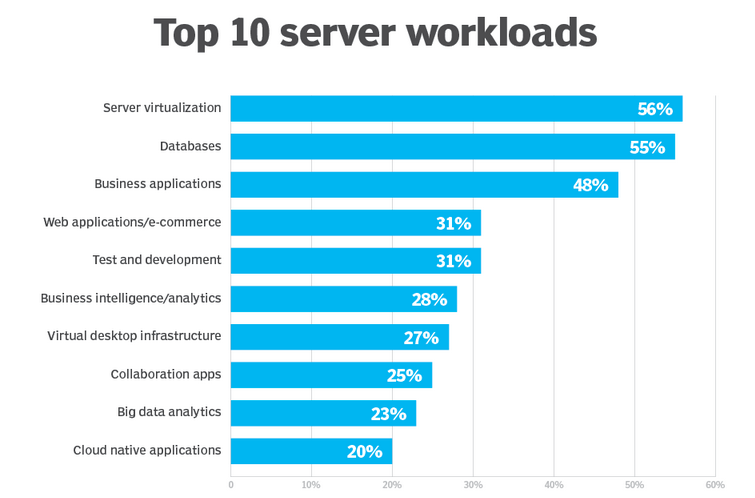

# Workload
- Any program or application that runes on any computer
- Can also mean the amount of work (or load) a software imposes on the underlying computing resources
- A light workload consumes a relative low usage of computer resources
## Types of workload
### Static
- Workload that is always on and running (Operative Systems, Email Systems, ERP's, Customer Relationship Management(CRM))
### Dynamic
- Workload that only loads when needed so (tests or perform end-of-pointh billing for example)
### Transactional
- Workload that exchange and process data on demand or as needed
### Analytical
- Workload that consist in analyzing data, sometimes from multiple sources to find trends, make predictions and drive adjustments to business operations and relationships (big data and machine learning)
### High-performance computing (HPC)
- Workload that demands a large amount of processor and storage resources to accomplish demanding computational tasks within a limited timeframe
### Database
- Workloads that enphase the search performance for outside applications that depend of that data
### SaaS (software as service)
- Software distribution model in which a cloud provider hosts apps and makes them available to end users over the internet (using of a already built service)
### Microservices-based apps
- Approach for app development when a large application is built uppon modular components or services that communicate with each other over apis
### Serverless computing
- Cloud computing execution model that lets software developers build and run apps and servers without having to manage a back-end infrastructure(put our service on the cloud)

## Challenges
- Knowing where to deploy the workload, if we should either deploy it in on our own data center or if we should put it on the cloud. This depends of the need of the project.
- Example of this is a database cluster that need high throughput and low latency. This may be unsuited for the cloud
- Apps that relly on low latency or are not designed for distributed computing infrastructures are usually kept in premises