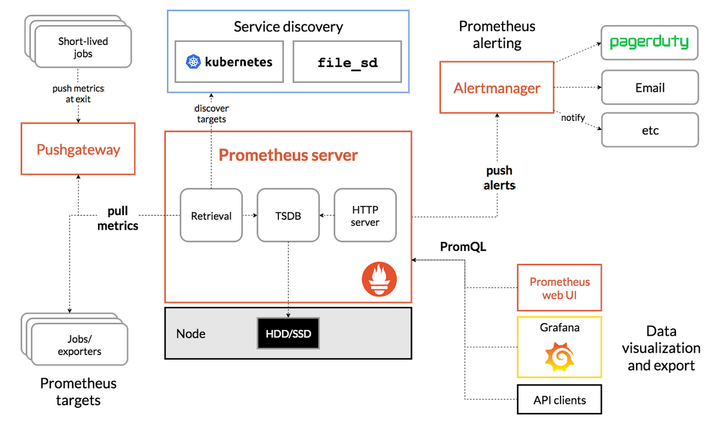

# Prometheus
- Open source systems monitoring and alerting toolkit 
- Collects and stores its metrics as time series data
## Features
- multi-dimensional data model with time series data identified by metric name and key/value pairs
- PromQL, a flexible query language
- no reliance on distributed storage
- time series collection happens via pull model over HTTP
- pushing time series is supported via an intermediary gateway
- targets are discovered via service discovery or static configuration
- multiple modes of graphing and dashboarding support
## Metrics
- numerical measurements
- time series refers to the recording of changes over time
- what users may want to measure is different from app to app
- It is by this that you know where to make your solution better
## Components
- Prometheus server which stores time series data
- client libraries for app code
- push gateway for short-lived jobs
- special-purpose exporters for services like HAProxy
- an alertmanager for alerts
- various support tools
## Architecture

- Prometheus stores metrics from instrumented jobs directly or via intermediary push gateway for short-lived jobs
- Stores data locally and runs rules over this data
# First steps
- Download prometheus (we will not do this because we will get the data via metrics in hyperledger fabrics)
- config prometheus
- starting prometheus
## Concepts
### [Data Model](./datamodel.md)
### [Metric types](./metricTypes.md)
### [Jobs and isntances](./jobs-and-instances.md)
### [Prometheus Remote-Write Specification](./prometheus-remote-write-specification.md)
## Getting started
- Install the rar file of prometheus from the repositories (we should download in the source because if not we will only get the binaries and we want the graphical interface as well)
- Add a job and a target.. for hyper ledger fabric we will add our metrics as so:
  ```
  scrape_configs:
  - job_name: 'fabric-peer'
    static_configs:
      - targets: ['peer1.example.com:9090', 'peer2.example.com:9090']

  - job_name: 'fabric-orderer'
    static_configs:
      - targets: ['orderer1.example.com:9091', 'orderer2.example.com:9091']
  ```
- We can add multiple targets to the same job and identify those targets by label
```
scrape_configs:
  - job_name:       'node'

    # Override the global default and scrape targets from this job every 5 seconds.
    scrape_interval: 5s

    static_configs:
      - targets: ['localhost:8080', 'localhost:8081']
        labels:
          group: 'production'

      - targets: ['localhost:8082']
        labels:
          group: 'canary'
```
- Note that we can also have multiple jobs
- In order to test that config and also test another configurations, we will create a node_exporter 
- In order to achieve this, we download the node_exporter
- Then we executed it as so
  ```
  ./node_exporter --web.listen-address 127.0.0.1:8080
  ./node_exporter --web.listen-address 127.0.0.1:8081
  ./node_exporter --web.listen-address 127.0.0.1:8082
  ```
- Also we will aplly the configuration that we spoke of in the prometheus yaml file  
  ```
   # Override the global default and scrape targets from this job every 5 seconds.
    scrape_interval: 5s

    static_configs:
      - targets: ['localhost:8080', 'localhost:8081']
        labels:
          group: 'production'

      - targets: ['localhost:8082']
        labels:
          group: 'canary'
  ```
### Rules
- We can create a rule for a specific query like so:
  ```
    groups:
- name: cpu-node
  rules:
  - record: job_instance_mode:node_cpu_seconds:avg_rate5m
    expr: avg by (job, instance, mode) (rate(node_cpu_seconds_total[5m]))
  ```
- Put that inside of a file called prometheus.rules.yml
- Now we should add it to the prometheus.yaml
  ```
  rule_files:
    - 'prometheus.rules.yml'
  ```
  - Reload prometheus server and query the "record"
### Reloading
- We can reload prometheus config by killing is process using this 
  ```
  kill -s SIGHUP <PID>
  ```
## [Configurations](./configurations/readme.md)

## [Querying](./querying/readme.md)

## [Operators](./operators/readme.md)