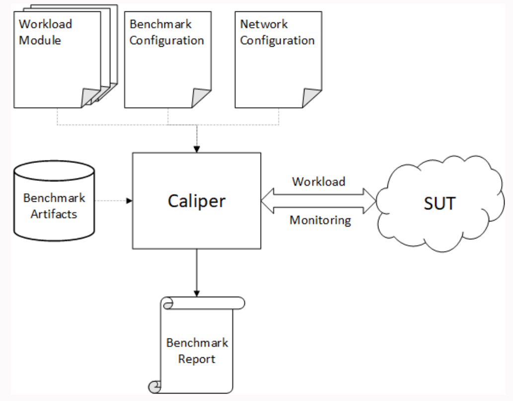
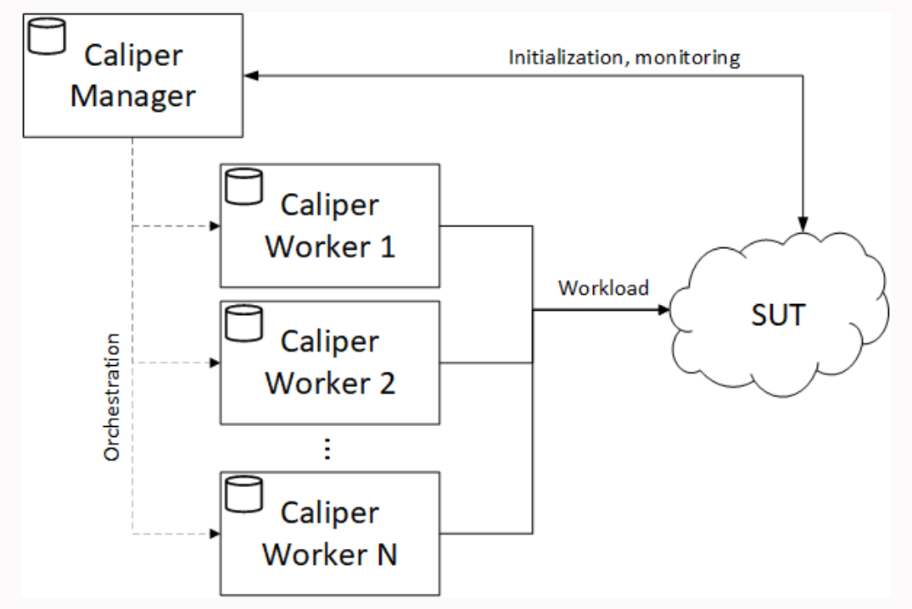
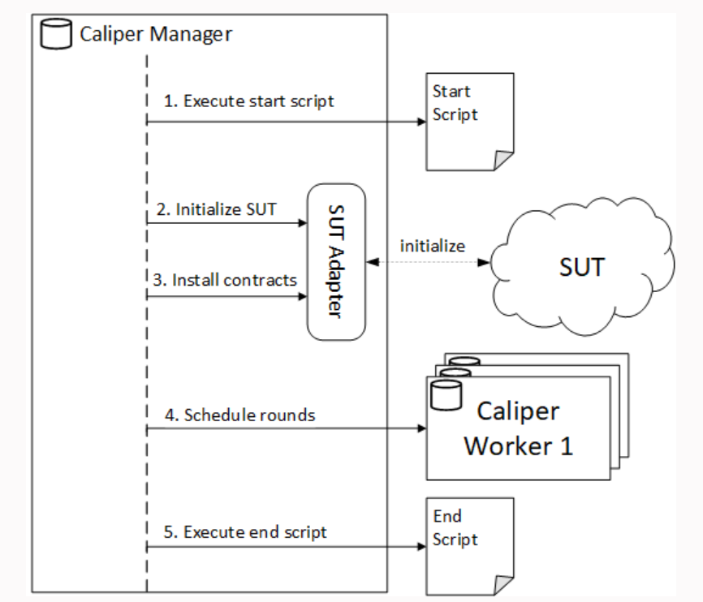
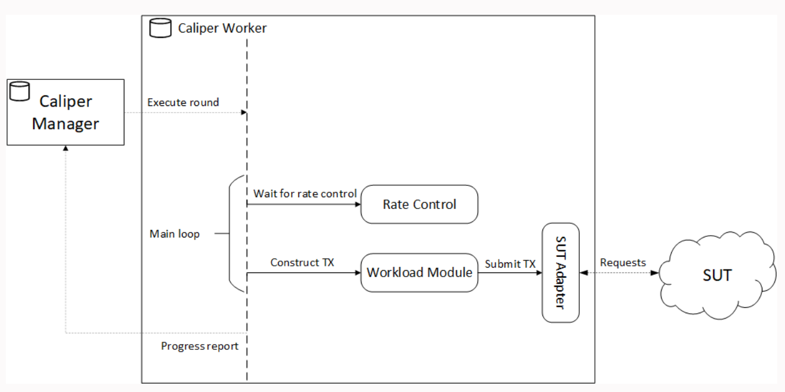
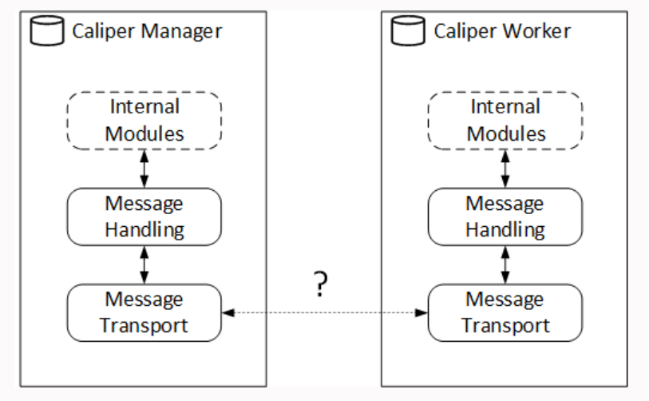
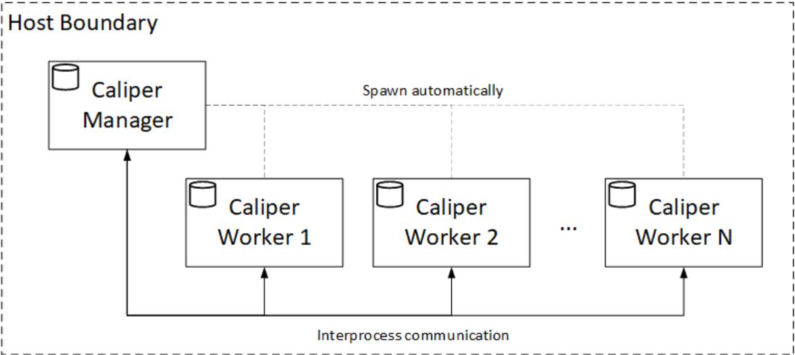
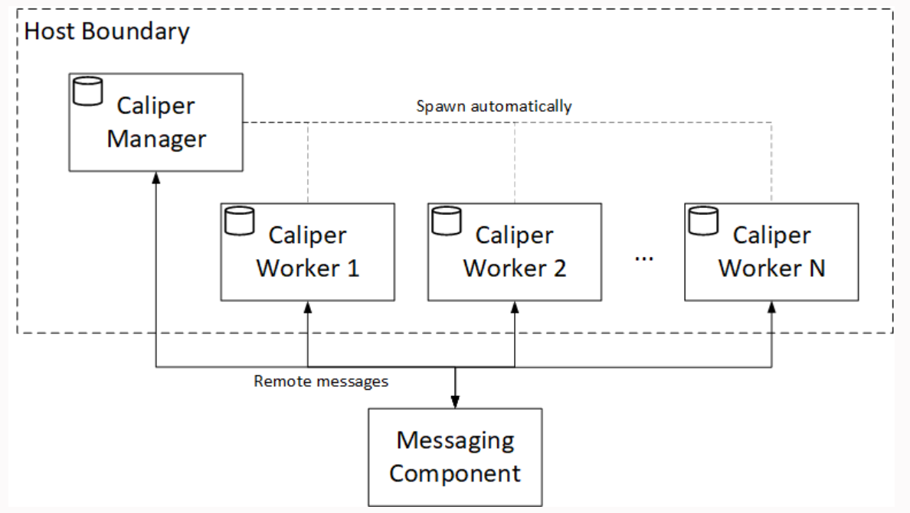
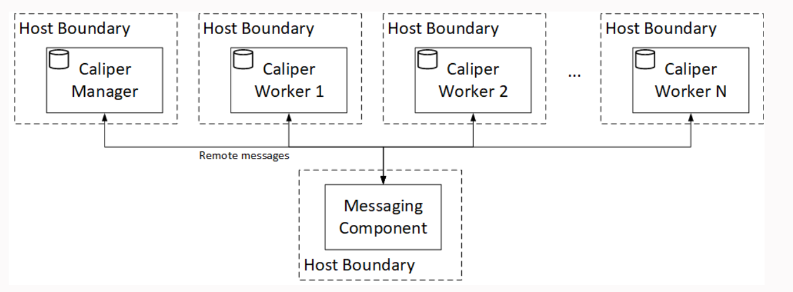

# Caliper
- Blockchain performance benchmark framework, which allows users to test diffeerent blockchain solutions with custom use cases
## Supported blockchain solutions
- Hyperledger Besu
- Ethereum
- Hyperledger fabric
- FISCO BCOS
## Supported performance metrics
- Transaction/read throughput
- Transaction/read latency
- Resource consumption
## Architecture
### Bird's eye view
- Caliper is a service that generates a workload against a specific system under test (SUT) and continuously monitors its responses. 
- It generates a report based on the observed SUT responses.

### Benchmark config file
- This is a file that describes how the benchmark should be executed
- It tells caliper how many rounds it should execute
- At what rate the TXs should be submitted
- Which module will generate the TX content
- It includes settings about monitoring the SUT (which is the system under test)
- Settings are SUT independent, you can use the same settings for multiple versions of your system but this characteristic can be avoided if you specifically target a specific version of the system
- Basicly it is the responsible for dictate the execution of the workloads and the results of the benching
- See the constitution [here](bench-config.md)
### Benchmark artifacts
- Crypto materials necessary to interact with the SUT
- Smart contract source code for caliper to deploy (If the SUT connector support such operation)
- Runtime config files 
- Pre-installed third party packages for your workload modules
### [Writing connectors](connectors.md)
### Caliper processes
- Caliper has two different services/processes:
    - The manager process which initializes the SUT and coordinates the run of the benchmark (schedules the configured rounds) and handles performance report generation based on the observed TX statistics
    - The worker processes perform the actual workload generation,independently of each other. Even if a worker process reaches the limits of its host machine, using more worker processes (on multiple machines) cam further increase the workload rate of caliper. Thus worker processes are the backbone of Caliper's scalability
    
#### Manager processes

1. In the first stage, caliper executes the startup script (if present) from the network configuration file. This step is mainly useful for local caliper and SUT deployments as it provides a convenient way to start the network and caliper in one step. The deployment is not responsibility of Caliper.
2. In the secound stage, caliper initializes the SUT. The tasks performed here are highly dependent on the capabilities of the SUT and the SUT connector. In hyperledger fabric we use this stage to create/join channels and register/enroll users
3. In the third stage, Caliper deploys the smart contracts to the SUT, if the SUT and the connector support such operation (like with hyper ledger fabric connector)
4. In the fourth stage Caliper schedules and executes the configured rounds through the worker processes. This is the stage where the workload generation happens (throught the workers!)
5. In the last stage, after executing the rounds and generating the report, caliper executes the cleanup script (if present) from the configuration file. This is also something usefull for local deployments
- The scripts part is controlled by the scripts table in the runtime configs
#### The worker process

- The worker procces spends most of its time in the workload generation loop. The loop consists of two important steps:
  1. Waiting for the rate controller to enable the next TX
  2. Once the rate controller enables the next TX, the worker gives control to the workload module. The workload module assembles the parameteres of the TX (specific to the SUT and smart contract API) and calls the simple API of the SUT connector that will, in turn, send the TX request to the SUT(probably using the SDK of the SUT)
- During the workload loop, the worker process sends progress updates to the manager process. Progress reporting on the manager side can be enabled and configured with the ***caliper-progress-reporting-enabled*** and ***caliper-progress-reporting-interval*** (see runtime settings, the basic ones)
### Process distribution models
- There are 3 different deployment models
  1. Automatically spawned worker processes on the same host, using interprocess communications (IPC) with the manager process
  2. Automatically spawned worker processes on the same host, using a remote messaging mechanism with the manager process
  3. Manually started worker processes on an arbitrary number of hosts, using a remote messaging mechanism with the manager process
- Its for the best starting with 1/2 and then go to the third step 
#### Modular message transport

- This is how caliper handles messaging internally
- The message module is swappable,thus enabling different communication methods
- The deployment model is configurable with the following two setting keys:
    - ***caliper-worker-remote***: if set to false (default) then the manager process will spawn the required number of worker processes locally, resulting in the module 1 or 2
    - ***caliper-worker-communication-method***: can take the values **process** (the default) or **mqtt** and determine the message transport implementation to use. The **process** communication corresponds to the first model, while **mqtt** denotes models 2 and 3
    ##### The different models
    | **remote** value | **method** value | Corresponding deployment model                              |
    | ---------------- | ---------------- | ----------------------------------------------------------- |
    | false            | process          | 1. Interprocess communication with local workers            |
    | false            | mqtt             | 2. Remote messaging-based communication with local workers  |
    | true             | mqtt             | 3. Remote messaging-based communication with remote workers |
    | true             | process          | Invalid, since IPC does not apply to remote communication   |
    ##### [Messengers config](messengers.md)
#### Interprocess communication
- This is the default behavior of a message protocol or **process** message protocol

- This is the simplest deployment model for caliper, requiring no additional config and third party messaging components
- It is the ideal for the first time starting caliper
- It is constrained to a single host
#### Local message broker communication
- This is the other behavior, that makes usage of a message broker and a publisher subscriber pattern

- It is the exact same thing, the difference is that instead of communicating directly to another component, it sends to a broker the message and the broker distributes the messages
- In this setup, the communications stills local, but the same logic applies when we want to distribute the workers
#### Distibuted message broker communication

## Installing and Running Caliper
- Installing and running caliper consists in the following steps:
  1. Acquire the Caliper CLI either from NPM or DockerHub
  2. Execute a bind command through the CLI. This step pulls the specified version of SDP packages for the selected platform
  3. Start the benchmark through the CLI or by starting the Docker Container
- We can find samples of config in [Here](https://github.com/hyperledger/caliper-benchmarks)
### Cloning the repository to follow along
```
git clone https://github.com/hyperledger/caliper-benchmarks.git
cd caliper-benchmarks
git checkout <your Caliper version>
```
### Install binarie by npm
```
npm install --only=prod @hyperledger/caliper-cli@0.5.0
```
### Bind command
- You can use "npx caliper bind", to inject some dependencies relative to the dependencies you configured in a yaml file like we saw before in the bind configurations
### Unbind command
- This is to unbind the configurations that we setted just before
### Launch command
- It was tought to generate both manager and workers up and running
### To make all work
- To make all work we must config the caliper-workspace, caliper-benchconfig and caliper-networkconfig
