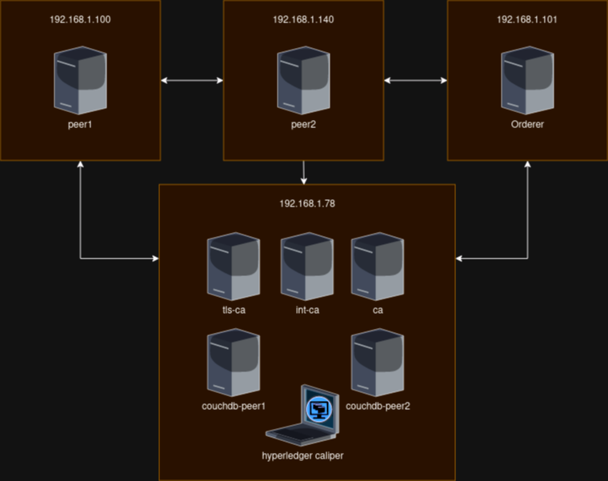
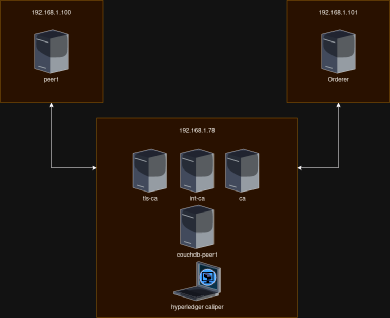
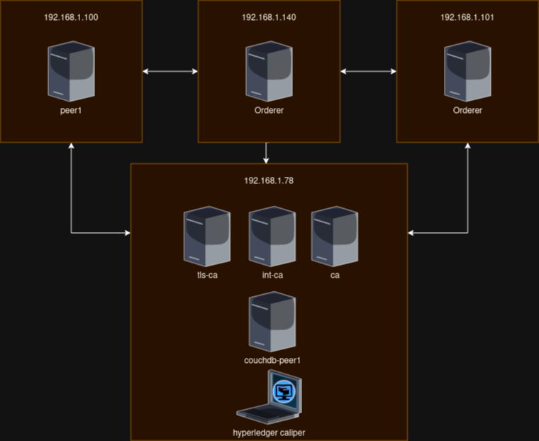
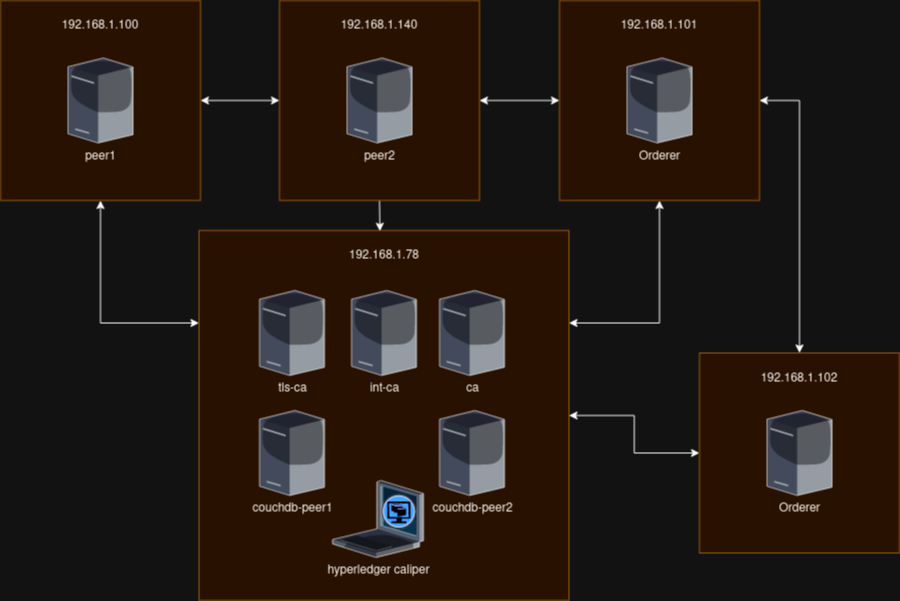

# Scenario [NORMAL SCENARIO](The one that we been using for testing)

# Possible optimizations in a hyper ledger fabric network
    1. Network Configuration: [ELIGIBLE]
        Consensus Mechanism: Depending on your network's requirements, you can optimize the consensus mechanism (e.g., Raft, Kafka) and its configuration settings to achieve better transaction throughput and latency.

    2. Peers and Ordering Service: [ELIGIBLE]
        Resource Allocation: Ensure that each peer and orderer node has sufficient CPU, memory, and storage resources allocated to handle the expected transaction load efficiently.
        Scaling: Consider adding more peers and orderers as needed to distribute the processing load and enhance network capacity.
        Load Balancing: Implement load balancing to evenly distribute transaction requests across multiple peers or endorsing peers.

    3. Database Configuration: [ELIGIBLE]
        Database Tuning: Optimize the database configuration, indexing, and caching mechanisms to improve query performance and data retrieval.
        Database Scalability: Ensure that your database can scale horizontally as the network grows, allowing for efficient data storage and retrieval.

    4. Caching Mechanisms: [NOT ELIGIBLE(this requires a extra layer, not appliable now)]
        Caching: Implement caching mechanisms to reduce redundant queries to the ledger or to store frequently accessed data, reducing the load on the blockchain.

    5. Channel Configuration: [NOT ELIGIBLE (The benchmarking will be done in a small network for now)]
        Use of Channels: Utilize channels effectively to segregate and isolate data and transactions for different participants or use cases. Proper channel design can improve privacy and scalability.

    6. Endorsement Policies [NOT ELIGIBLE (The benchmarking will be done in a small network for now)]:
        Endorsement Optimization: Carefully design endorsement policies to reduce the number of required endorsements while maintaining security and trust.

    7. Peer Connectivity and Network Topology: [NOT ELIGIBLE (We cannot do such things in the hospital but locally we can but it is not a problem at all for benchmarking)]
        Network Latency: Minimize network latency by optimizing the physical or logical network topology, ensuring peers are well-connected, and using low-latency network links.

    8. Monitoring and Profiling: [NOT ELIGIBLE (This is for production systems)]
        Performance Monitoring: Implement monitoring tools and practices to continuously monitor the network's performance, resource utilization, and transaction latency. Use profiling tools to identify bottlenecks and resource constraints.

    9. Code Efficiency: [NOT ELIGIBLE (We will use a very basic contract)]
        Chaincode Efficiency: Optimize your smart contract (chaincode) code for efficiency and speed. This includes minimizing resource consumption, reducing complex computations, and efficient data storage.
# Important things to notice in the architecture (that we can manipulate of course)
|Concern_Id|Concern|Component|
|---|--|--|
|1|In legacy SDK, the client connects to every peer, collects the endorsements and then communicates directly with the orderer|client/peer|
|2|In the new SDK, the client connects to a single peer and the peer does the rest for him|client/peer|
|3|gateway settings|peer|
|4|keep alive settings|peer|
|5|gossip protocol config|peer|
|6|state configurations|peer|
|7|deliveryclient configurations|peer|
|8|discovery configurations|peer|
|9|limits configurations|peer|
|10|chaincode execution config|peer|
|11|db access configuration|peer|
|12|Request limits|peer|
|13|db indexing|db|
|14|history of updates/operations|db|
|15|Keep alive options|orderer|
|16|Time difference allowed|orderer|
|17|Batch timeout|channel config|
|18|Batch Size|channel config|
|19|Number of workers|client|
|20|Rate of requests|client|
|21|Smart contract function type|client|
# Insights about concerns
|Concern_ID|Term|Definition|Implications/Major Concerns|
|--|--|--|--|
|1|||1. Latency (client waiting for a probable high volume of peers)   2. Network Overhead (client establishing connections with multiple peers and concurrent transactions)   3. Client Resource Utilization|
|2|||1. Latency(peer waiting for a probable high volume of peers) 2. Network Overhead (peer waiting for the answer of multiple peers) 3. We need to build a connector with this approach for caliper |
|3|endorsementTimeout|The maximum amout of time the client (gateway) will wait for endorsement responses from the endorsing peers|1. Finding balance in the time we intend to apply 2. Short can speed up transactions 3. To Short can leave incomplete endorsements under heavy load 4. To long can congest the network|
|3|broadcastTimeout|The maximum amount of time the client will wait for a transaction to be sucessfully broadcasted to the ordering service|1. Finding balance in the time we intend to apply 2. Short can reduce the time for the user to confirm transaction submission 3. To short may result in failed transactions if it takes longer because of congestion 4. To long may cause congestion|
|3|dialTimeout|The maximum amount of time the client will wait for establishing connections to endorsing peers and the orderer|1. Finding balance in the time we intend to apply 2. Short may reduce time to initiate transactions 3. Too short may lead to connection failures 4. Too long may cause a stuck connection|
|4|interval|Time interval at which a peer sends keepalive messages to other peers|1. Shorter can detect and recover from network issues faster 2. To short may result in network overhead|
|4|timeout|How long does a peer waits for a response to a keepalive message before considering the other peer unresponsive|1. Shorter can result in quicker detection of unresponsive peers but may lead to false positives in possible delays 2. Longer may be better for delays but it takes more time to identify unresponsive peers|
|4|minInterval|minimum allowable time interval between sucessive keepalive messages sent by a peer to another|1. Short time will produce frequent keepalives, quick detection, reduced latency to detections of unresponsiveness or network disruptions and increase of Overhead 2. Long values will result in slow error detection, slower recovery, lower overhead and lower resource usage|
|4|client.timeout && client.interval|control the keepalive interval and timeout of outgoing connections to other peers|1. Health of client connections|
|4|deliveryClient.interval|the time interval at which the delivery client sends keepalive messages to the ordering service to maintain connection|1. Shorter time maintain a responsive and active connection 2. Shorter time may increase network traffic|
|4|deliveryClient.timeout|maximum amount of time that the delivery client will wait for a response from the ordering service|1. if delivery client does not receive this response it may think that the connection is now unresponsive or disconnected|
|5|membershipTrackerInterval|Interval in milisecounds at which a node gossip updates its membership information|1. Network latency since a lower interval can result in more updates but also more traffic  2. Resource Usage, increase updates increase the resource usage  3. Fault Detection   4. Configuration consistency|
|5|maxBlockCountToStore|maximum number of blocks that a peer node will store in its local ledger|1. Resource Utilization, since it will increase the memory and operations over the data 2.Data Retention, lowering the value may lead to data loss because the blocks got pruned 3.Query performance is affected with more blocks 4.Sync of blocks with other peers becomes harder|
|5|maxPropagationBurstLatency|maximum amount of time in milliseconds that a gossip propagation can last|1.Network Traffic 2.Resource Usage|
|5|maxPropagationBurstSize|The maximum of messages that a peer can send out in a single burst during gossip message propagation|1.Latency vs Efficiency, this property impacts the tradeoff between latency and efficiency.Larger burst size allows more messages to be sent in a single manner, reducing time to do information spread. But it also increases network congestion 2.Network traffic 3.Resource Utilization|
|5|propagateIterations|determines how many iterations or rounds of message propagation will occur|1.Latency and Efficiency, increasing this value leads to messages taking longer to propagate across the network 2.Network traffic 3.Network Traffic 4.Resource Utilization|
|5|propagatePeerNum|number of peer nodes to which a gossip protocol message will be propagated during each iteration|1.Latency vs Efficiency because it impacts the speed that the message spreads all over the network 2.Network Traffic 3.Resource Utilization|
|5|pullInterval|specifies the time (in milliseconds) at which peer node will actively pull data from other peers|1.Data sync 2.Latency vs Efficiency 3.Network traffic|
|5|pullPeerNum|maximum number of peer nodes from which a peer will actively request and pull data|1.Resource Utilization 2.Network Traffic 3.Sync Efficiency|
|5|requestStateInfoInterval|maximum number of peer nodes from which a peer will actively request and pull data|1. State sync 2.Network traffic 3.Resource utilization|
|5|publishStateInfoInterval|time interval (in milliseconds) at which a peer node will broadcast its own state information to other peers in the network using the gossip protocol.|1.State broadcast 2.State info freshness 3.Network traffic 4.Resource Utilization|
|5|stateInfoRetentionInterval|time interval (in milliseconds) for which a peer node will retain and consider state information received from other peers as valid and usable|1.State info retention 2.State info validity period 3.Network traffic 4.Resource Utilization|
|5|publishCertPeriod|the time interval (in milliseconds) at which a peer node will broadcast its own membership certificate to other peers in the network using the gossip protocol|1. Membership certificate publication 2. Membership Certificate freshness 3.Network traffic|
|5|skipBlockVerification|boolean property that specifies whether a peer node should skip the verification of blocks received from other peers through the gossip protocol|1. Block verification 2.Security 3.Consistency|
|5|dialTimeout|maximum time (in milliseconds) that a peer node will wait when attempting to establish a network connection to another peer|1.Connection Establishment 2.Network Latency 3.Resource Usage|
|5|connTimeout|maximum time (in milliseconds) that a peer node will wait for a network connection to become fully established when attempting to connect to another peer|1.Connection establishment 2.Network Latency 3.Resource Usage|
|5|recvBuffSize|specifies the size (in bytes) of the receive buffer allocated for incoming messages|1.Message Reception 2.Memory, because it will increase the ram needed for each message 3.Network Latency|
|5|sendBuffSize|specifies the size (in bytes) of the send buffer allocated for outgoing messages in the gossip protocol|1.Message Transmission 2.Memory 3.Network Traffic|
|5|digestWaitTime|specifies the time interval (in milliseconds) that a peer node will wait before requesting a missing message digest from another peer during data synchronization|1.Data sync 2.Network Traffic 3.Resource Utilization|
|5|requestWaitTime|the time interval (in milliseconds) that a peer node will wait before retrying a request to another peer in the network|1.Retries 2.Network Traffic 3.Resource Utilization|
|5|responseWaitTime|maximum time (in milliseconds) that a peer node will wait for a response to a request it has sent to another peer in the network|1.Network Traffic 2.Resource Utilization 3.Timeout Handling|
|5|aliveTimeInterval|the time interval (in milliseconds) at which a peer node will send "alive" messages to other peers in the network|1.HearthBeat mechanism 2.Network Monitoring 3.Resource Usage|
|5|aliveExpirationTimeout|maximum time (in milliseconds) that a peer node will wait for an "alive" message from another peer. If an "alive" message is not received within this timeout, the peer may consider the other peer as unresponsive|1.Detection of unresponsive peers 2.Timeout 4.Network Monitoring|
|5|reconnectInterval|time interval (in milliseconds) that a peer node will wait before attempting to reconnect to other peers in the network after detecting a network connection failure|1.Connection Maintenance 2.Recovery Time 3.Network Resillence 4.Resource Usage|
|5|maxConnectionAttempts|the maximum number of attempts a peer node will make to establish a network connection with another peer using the gossip protocol. If the maximum number of connection attempts is reached without successfully establishing a connection, the peer may consider the connection as failed|1.Connection Establishment 2.Connection Reliability 3.Resource Usage|
|5|msgExpirationFactor|factor used to calculate the expiration time of messages propagated via the gossip protocol. The factor is multiplied by the message's maximum allowed propagation delay to determine its expiration time|1.Message Expiration 2.Message Freshness 3.Resource Usage|
|5|election.startupGracePeriod|the duration (in milliseconds) for which a peer node will allow other peers to join and participate in leader election processes after its own startup|1.Leader Election 2.Network stability 3.Resource Availability|
|5|election.membershipSampleInterval|time interval (in milliseconds) at which a peer node samples the network's membership list to assess the presence and activity of other peers. This information is used in leader election processes|1.Leader election 2.Network Monitoring 3.Resource Usage|
|5|election.leaderAliveThreshold|the threshold for considering the current leader alive in the gossip protocol. The threshold is specified as a time duration in milliseconds|1.Leader election 2.Network stability 3.Resource Usage|
|5|election.leaderElectionDuration| the maximum time (in milliseconds) allowed for a leader election process in the|1.Leader Election 2.Leader Availability 3.Resource Usage|
|5|pvtData.pullRetryThreshold|he maximum number of times a peer node will attempt to retrieve private data from other peers in the network before marking the operation as unsuccessful and potentially raising an error|1.Private data Retrieval 2.Data Privacy 3.Resource Usage|
|5|pvtData.transientstoreMaxBlockRetention|he maximum number of blocks for which private data is retained in the transient data store. This property affects the storage and retention policy for private data, which is an important aspect of maintaining data privacy and compliance in a Hyperledger Fabric network|1.Private Data Storage 2.Data Privacy 3.Resource Usage|
|5|pvtData.pushAckTimeout|the maximum time (in milliseconds) that a peer node will wait for acknowledgment from other peers after pushing private data to them|1.Private Data Dissemination 2.Data Privacy 3.Data Consistency 4.Resource Usage|
|5|pvtData.btlPullMargin|sets the margin, measured in blocks, that a peer node considers when pulling private data from other peers. The margin is added to the block number of the transaction that triggered the private data pull|1.Private Data Retrieval 2.Data Availability 3.Transaction Validation 4.Resource Usage|
|5|pvtData.reconcileBatchSize| sets the batch size used for reconciling private data among peer nodes in the Hyperledger Fabric network. Reconciliation ensures that authorized peers have the same private data collections|1.Private Data Reconciliation 2.Data Consistency 3.Resource Usage|
|5|pvtData.reconcileSleepInterval| specifies the sleep interval, in milliseconds, that a peer node waits between consecutive private data reconciliation cycles. Reconciliation is the process of ensuring that all authorized peers have the same private data.|1.Private Data Reconciliation 2.Data Consistency 3.Resource Usage|
|6|checkInterval|specifies the time interval, in milliseconds, at which the state database of a Hyperledger Fabric peer node is checked for inconsistencies or discrepancies with the ledger or other peers' state databases|1.State consistency 2.Resource Usage 3.Block Validation 4.Blockchain Performance|
|6|responseTimeout|the maximum response timeout, in milliseconds, that a Hyperledger Fabric peer node will wait for responses from other nodes when performing state-related operations such as querying the ledger or retrieving state data|1.State Operations 2.Query Latency 3.Transaction commit|
|6|batchSize|the batch size used for retrieving and processing data from the ledger's state database. It determines how many records are fetched and processed in a single batch during state-related operations|1. State Operations 2.Query Efficiency 3.Resource Usage|
|6|blockBufferSize|the size, in bytes, of the buffer used for temporarily storing blocks during state-related operations|1.State Operations 2.Memory Consumption 3.Query Efficiency|
|6|maxRetries|the maximum number of retry attempts that a Hyperledger Fabric peer node will make when encountering errors during state-related operations, such as querying or updating the ledger's state|1.State Operations 2.Error Handling 3.Resource Usage|
|7|reconnectTotalTimeThreshold|specifies the maximum time, in milliseconds, that a delivery client will spend attempting to reconnect to a remote peer after a connection failure before considering the reconnection as unsuccessful|1.Block sync 2.Network Reliability 3.Resources Usage|
|7|connTimeout|the maximum connection timeout, in milliseconds, that a Hyperledger Fabric peer node will wait for when establishing network connections with other nodes.|1.Network Connectivity 2.Resource Usage|
|7|reConnectBackoffThreshold|the threshold that, when exceeded, triggers a backoff and retry strategy for connection attempts to a remote node after a connection failure. The threshold is defined in milliseconds.|1.Network Connectivity 2.Connection Retry Stategy 3.Resource Usage|
|8|authCacheMaxSize|the maximum number of entries that can be cached in the authentication cache of the discovery service in Hyperledger Fabric. This cache stores authentication information about peers and organizations discovered in the network.|1.Discovery Service 2.Memory 3.Resource Usage|
|8|authCachePurgeRetentionRation|the ratio of cache entries that should be retained when the auth cache of the delivery client is purged to make room for new entries. The value is typically expressed as a decimal fraction.|1.Delivery Client 2.Cache Purging Cache Efficiency|
|9|concurrency.endorserService|the level of concurrency, typically expressed as the maximum number of concurrent discovery requests, that are allowed when discovering endorser peers|1.Service Discovery |
|9|concurrency.deliverService|the level of concurrency, typically expressed as the maximum number of concurrent discovery requests, that are allowed when discovering deliver peers|1.Service Discovery 2.Peer Discovery Resource Consumption 3.Network Load|
|9|concurrency.gatewayService|the level of concurrency, typically expressed as the maximum number of concurrent requests, that are allowed when interacting with the gateway service for block and transaction delivery|1.Block and Transaction delivery 2.Resource Usage 3.Network Load|
|9|maxRecvMsgSize| the maximum size, in bytes, of messages that the delivery client is willing to receive from other network peers during the block and transaction delivery process|1.Message Size Limit 2.Data Transmission 3.Resource Usage|
|9|maxSendMsgSize|the maximum size, in bytes, of messages that the delivery client can send to other network peers during the block and transaction delivery process|1.Message Size Limit 2.Data Transmission 3.Resource Usage|
|10|executetimeout|refers to the maximum amount of time (in seconds) that a chaincode invocation or transaction is allowed to execute before it is terminated.|1.Execution time limit 2.Preventing Stalemate 3.Resource Management|
|11|ledger.state.requestTimeout|the timeout duration for client requests to the blockchain network, including queries and transactions. If a response is not received within the specified time, the request is considered failed|1.Error handling 2.Response Configuration(client side) 3.Latency Considerations|
|11|ledger.state.internalQueryLimit|limit on the number of records per each couchdb query|1.Querys 2.Latency 3.Network congestion|
|11|ledger.state.maxBatchUpdateSize|limit on the number of records per couchdb bulk update batch|1.Update batching 2.Latency 3.Network congestion|
|11|ledger.state.cacheSize|in-memory state cache|1.Memory 2.Latency 3.Resource Usage|

Some configs are not here because they represent the same despite beeing in different components

# Scenario 1 (1 peer + 1 orderer)

## 1.1.1 
- 2 Workers
- Normal Rate
- Read Function
## 1.1.2
- 4 Workers
- Normal Rate
- Read Function
## 1.1.3
- 8 Workers
- Normal Rate
- Read Function
## 1.2.1
- 2 Workers
- Normal Rate
- Write Function
## 1.2.2
- 4 Workers
- Normal Rate
- Write Function
## 1.2.3
- 8 Workers
- Normal Rate
- Write Function
# Scenario 2 (2 peers + 1 orderer)

## 2.1.1 
- 2 Workers
- Normal Rate
- Read Function
## 2.1.2
- 4 Workers
- Normal Rate
- Read Function
## 2.1.3
- 8 Workers
- Normal Rate
- Read Function
## 2.2.1
- 2 Workers
- Normal Rate
- Write Function
## 2.2.2
- 4 Workers
- Normal Rate
- Write Function
## 2.2.3
- 8 Workers
- Normal Rate
- Write Function
# Scenario 3 (1 peer + 2 orderers)

## 3.1.1 
- 2 Workers
- Normal Rate
- Read Function
## 3.1.2
- 4 Workers
- Normal Rate
- Read Function
## 3.1.3
- 8 Workers
- Normal Rate
- Read Function
## 3.2.1
- 2 Workers
- Normal Rate
- Write Function
## 3.2.2
- 4 Workers
- Normal Rate
- Write Function
## 3.2.3
- 8 Workers
- Normal Rate
- Write Function
# Scenario 4 (2 peers + 2 orderers)

## 4.1.1 
- 2 Workers
- Normal Rate
- Read Function
## 4.1.2
- 4 Workers
- Normal Rate
- Read Function
## 4.1.3
- 8 Workers
- Normal Rate
- Read Function
## 4.2.1
- 2 Workers
- Normal Rate
- Write Function
## 4.2.2
- 4 Workers
- Normal Rate
- Write Function
## 4.2.3
- 8 Workers
- Normal Rate
- Write Function
# Scenario 5 (1 peer org1 + 1 peer org2 + 1 orderer)

## 5.1.1 
- 2 Workers
- Normal Rate
- Read Function
## 5.1.2
- 4 Workers
- Normal Rate
- Read Function
## 5.1.3
- 8 Workers
- Normal Rate
- Read Function
## 5.2.1
- 2 Workers
- Normal Rate
- Write Function
## 5.2.2
- 4 Workers
- Normal Rate
- Write Function
## 5.2.3
- 8 Workers
- Normal Rate
- Write Function
  
# Extra toughts
- In order to achieve monitoring and also measure everything in hyper ledge fabric, we need to also learn more about [prometheus](../prometheus/readme.md) and [grafana](../grafana/readme.md)